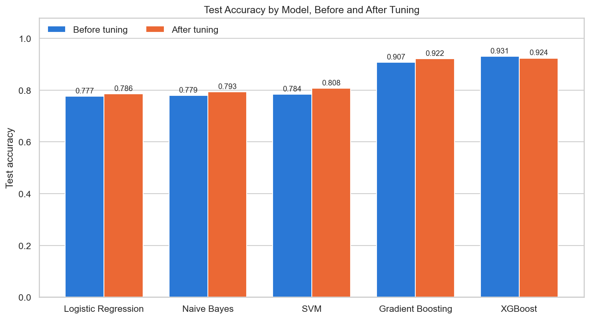

# Comparative Analysis of ML Algorithms to Predict Parkinson's Disease

Five classification algorithms compared, before and after hyperparameter tuning, on predicting a Parkinson's disease diagnosis from 2,105 patient records.

**Result:** tuned XGBoost was the best model, with **92.40% accuracy** and **95.80% ROC AUC** on a held-out test set.



## Dataset

- **Source:** [Parkinson's Disease Dataset Analysis](https://www.kaggle.com/datasets/rabieelkharoua/parkinsons-disease-dataset-analysis) by Rabie El Kharoua (Kaggle)
- **License:** [CC BY 4.0](https://creativecommons.org/licenses/by/4.0/)
- **Size:** 2,105 records, 35 columns (demographics, lifestyle, medical history, clinical measurements, cognitive and functional assessments, symptoms, and the `Diagnosis` label)
- **Synthetic:** the author states the data was generated for educational purposes. Nothing here is a clinical result.

The CSV is not included in this repository. See [data/README.md](data/README.md) for download steps.

## Approach

1. **Explore** the class balance, feature distributions and symptom flags.
2. **Split** the data 80/20 into training and test sets with a fixed seed.
3. **Baseline:** train each model with default settings.
4. **Tune:** 5-fold cross-validated grid search (`GridSearchCV`) on the training set only.
5. **Evaluate:** score each model once on the test set for accuracy, recall, F1 and ROC AUC.

Scaling is done inside a scikit-learn `Pipeline`, so the scaler is fit on training data only, including within each cross-validation fold. The test set plays no part in choosing hyperparameters.

Models: Logistic Regression, Gaussian Naive Bayes, SVM, Gradient Boosting, XGBoost.

## Results

Test set of 421 records. CV accuracy is the 5-fold cross-validated accuracy on the training set.

| Model | Stage | CV Accuracy | Train Accuracy | Test Accuracy | Recall | F1 | AUC |
|---|---|---|---|---|---|---|---|
| Logistic Regression | Before tuning | 0.8135 | 0.8308 | 0.7767 | 0.8450 | 0.8297 | 0.8794 |
| Logistic Regression | After tuning | 0.8165 | 0.8254 | 0.7862 | 0.8376 | 0.8346 | 0.8793 |
| Naive Bayes | Before tuning | 0.7910 | 0.8082 | 0.7791 | 0.8155 | 0.8262 | 0.8660 |
| Naive Bayes | After tuning | 0.8076 | 0.8302 | 0.7933 | 0.8487 | 0.8410 | 0.8807 |
| SVM | Before tuning | 0.8266 | 0.9418 | 0.7838 | 0.8561 | 0.8360 | 0.8781 |
| SVM | After tuning | 0.8379 | 0.9430 | 0.8076 | 0.8303 | 0.8475 | 0.8885 |
| Gradient Boosting | Before tuning | 0.9353 | 0.9703 | 0.9074 | 0.9114 | 0.9268 | 0.9540 |
| Gradient Boosting | After tuning | 0.9382 | 0.9935 | 0.9216 | 0.9151 | 0.9376 | 0.9580 |
| XGBoost | Before tuning | 0.9264 | 1.0000 | 0.9311 | 0.9299 | 0.9456 | 0.9608 |
| **XGBoost** | **After tuning** | **0.9412** | 0.9650 | **0.9240** | 0.9262 | 0.9401 | 0.9580 |

**Key takeaways**

- Boosted trees (XGBoost, Gradient Boosting) reach 92–93% test accuracy. The other three models reach 78–81%.
- Tuned XGBoost has the highest cross-validated accuracy, so it is the selected model. Default XGBoost scores 3 test records higher (93.11%), which is within the noise of a 421-record test set.
- Tuning added at most 2.5 points of test accuracy. The choice of algorithm mattered much more.

**Limitations**

- The data is synthetic, so the numbers do not transfer to real patients.
- The boosted models overfit: default XGBoost reaches 100% training accuracy. Regularisation narrowed the gap (96.5% train vs 92.4% test) but did not remove it.
- With 421 test records, the 95% confidence interval on the best accuracy is roughly ±2.5 points.
- UPDRS is a severity scale for people who already have Parkinson's, so it would not be available in a real early-screening setting.

## Run it locally

Requires Python 3.12.

```bash
git clone https://github.com/aimanhadii/parkinsons-disease-prediction.git
cd parkinsons-disease-prediction

python -m venv .venv
# Windows: .venv\Scripts\activate
# macOS/Linux: source .venv/bin/activate

pip install -r requirements.txt
```

Download the dataset into `data/` (see [data/README.md](data/README.md)), then:

```bash
jupyter notebook notebooks/Comparative_Analysis_of_ML_Algorithms_to_Predict_Parkinson_s_Disease.ipynb
```

Run all cells. The full run takes about 6 minutes on an 8-core laptop, most of it in the grid searches.

## Repository structure

```
├── README.md
├── requirements.txt
├── data/
│   └── README.md          # how to download the dataset
├── images/
│   └── test_accuracy_comparison.png
└── notebooks/
    └── Comparative_Analysis_of_ML_Algorithms_to_Predict_Parkinson_s_Disease.ipynb
```

## Author

**Sheikh Aiman Hadi bin Shekh Faisal**
Coursework project at the International Islamic University Malaysia (IIUM), Mar 2024 – Jun 2024.

- LinkedIn: `<your-linkedin-url>`
- Email: `<your-email>`

## Acknowledgements

Rabie El Kharoua. (2024). *Parkinson's Disease Dataset Analysis* [Data set]. Kaggle. https://doi.org/10.34740/KAGGLE/DSV/8668551
